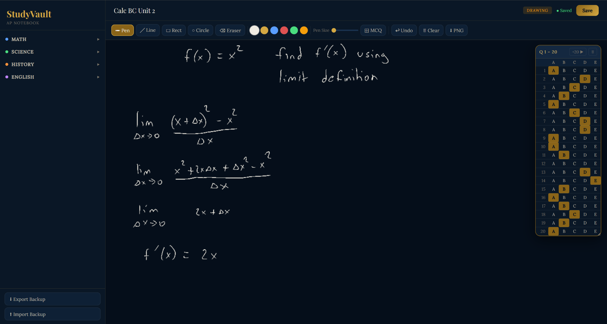
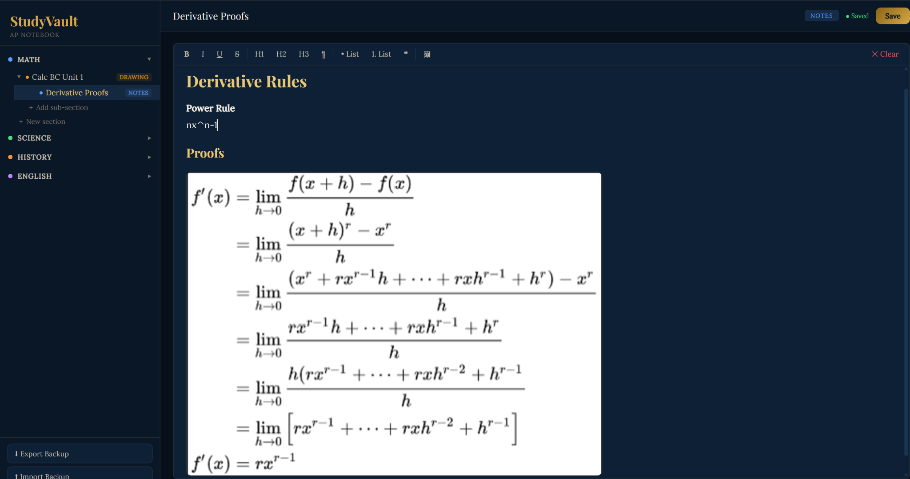

# StudyVault

A browser-based study notebook with drawing space, multiple-choice answer tracking, organized notes, and practice problems. It runs from one HTML file without an account or server.

## Why I use it

I used StudyVault for about four months to work through practice tests and take notes at home. The drawing workspace was the part I used most: I could work through a problem, erase my scratch work, and mark an answer choice in a panel beside the canvas. I wanted those actions together in one place instead of switching between a drawing tool and a separate answer sheet.

I also used the subject sections and subsections to organize notes. Being able to reopen saved work made it convenient for regular study sessions.

This is a personal study tool, not a permanent archive. Keep separate backups of anything important.

## Screenshots

### Drawing and answer tracking

Scratch work and selected A–E answers stay in the same workspace. Answer choices are recorded manually; the app does not grade them.

### Organized notes

Subjects, sections, and subsections keep related notes together. These screenshots show personal study sessions; their sample content is not bundled as a question bank or validated lesson material.

## Getting started

1. Download the repository using **Code → Download ZIP** and extract it.
2. Open `index.html` in a desktop browser.
3. Expand **Math**, **Science**, **History**, or **English** in the sidebar.
4. Select **+ New section**, enter a name, choose a section type, and click **Create**.
5. Use **+ Add sub-section** to group related material under a section.

There is no installation, build command, API key, or account setup. The page requests fonts from Google Fonts; the core application does not need a backend. If fonts cannot load, the browser uses fallback fonts. Clipboard features depend on browser permissions and support.

## Practice tests with the drawing workspace

1. Create a **Drawing** section for your test or topic.
2. Use **Pen**, **Line**, **Rect**, or **Circle** for scratch work. Adjust the color and pen size as needed.
3. Select **MCQ** to open the answer panel. It starts with questions 1–20 and choices A–E.
4. Work through a question and click its answer choice. Use **Eraser** or **Clear** to make room for the next problem; clearing the canvas does not reset the separate answer record.
5. Use **+20** for the next group of questions. Clicking **MCQ** again while the panel is visible also advances it.
6. Drag the panel by its header to move it out of the way.
7. Use **Save** and export a backup when finished. **PNG** saves the drawing canvas as an image, but does not include the answer panel.

The panel's trash button resets its answers across all groups. The current interface advances through groups but has no previous-group button. It is a simple answer recorder, not a complete test administration system.

## Notes and other features

| Section | What it supports | How it can help |
| --- | --- | --- |
| Notes | Headings, bold/italic text, lists, quotations, pasted images | Keep explanations and reference images together |
| Practice | Enter questions and answers; switch between Side by Side, Flashcard, and Scratch modes | Review answers or work through questions yourself |
| Missed | Review problems manually flagged from Practice sections | Collect questions to revisit |
| Drawing | Freehand work, shapes, erasing, undo, PNG export, MCQ answer panel | Work through written problems while recording answer choices |

To insert an image into a note, paste it directly into the editor. If the image toolbar button cannot access the clipboard, try **Ctrl+V** or **Cmd+V**. Questions and answers are supplied by the user; StudyVault does not generate explanations or automatically check correctness.

## Saving and backups — read before relying on it

**Save writes to the browser's local storage. It does not modify `index.html`, upload your notes to GitHub, or synchronize them between devices.** The sidebar organizes records inside the app; it is not a set of folders on your computer.

Many edits autosave after a short delay. Use **Save** before leaving and **Export Backup** regularly.

- **Export Backup** downloads a JSON file containing your study data, including stored drawings and answer choices.
- **Import Backup** restores a JSON backup and replaces the current app data after confirmation. Export the current data first if you want to keep it.
- Keep exported backups somewhere separate from browser storage. Open important backups in a separate browser profile to check restoration without replacing your working notebook.
- **PNG** is useful for keeping a copy of an individual drawing. It is not a complete notebook backup.

Clearing browser data, using private browsing, changing browsers or profiles, or moving/renaming the HTML file can make saved work disappear or become inaccessible. Storage behavior for locally opened files varies by browser. Back up before changing how or where you open the app.

Large drawings and pasted images can fill browser storage. The current app does not handle storage-full errors gracefully. Do not rely on it as the only copy of permanent notes, important assignments, or exam preparation materials.

## Current limitations

- No cloud backup, account system, or cross-device synchronization.
- No automatic grading, answer key, or test timer.
- Backup imports have limited validation; only import your own trusted backups. Saved rich-text content is rendered as HTML.
- Drawing dimensions depend on the available workspace; changing window size or device can affect how saved drawings are displayed.
- The answer-panel controls are basic. In addition to having no previous-group control, deselecting an answer can leave its visual highlight until the panel redraws.
- Desktop use is the main workflow. Touch, clipboard, and browser-storage behavior may differ between browsers and devices.

## AI use and authorship

The application's code was generated entirely with AI. I used the resulting tool for my own studying, especially drawing-based practice tests and organized notes. This repository shares that personal tool and its workflow; it is not a claim that I independently wrote the implementation.

The application is uploaded here as it was supplied. The README documents the existing behavior rather than claiming the listed limitations have been fixed.

## Files

- `index.html` — the complete app, including styles and JavaScript.
- `screenshots/drawing-practice.png` — drawing and multiple-choice workflow.
- `screenshots/organized-notes.png` — notes and section organization.
- `.gitignore` — excludes exported study backups and common local files.

The HTML starts with an empty notebook when no saved browser data is present. Downloading the source does not copy the author's browser-stored notes.
